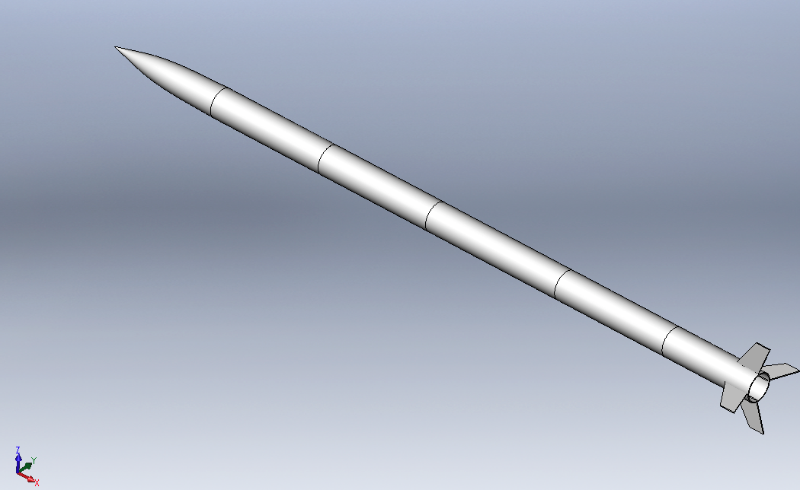
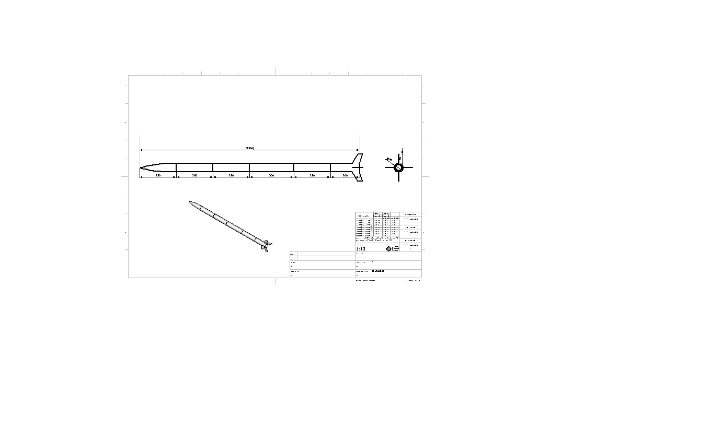
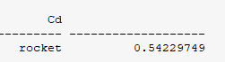
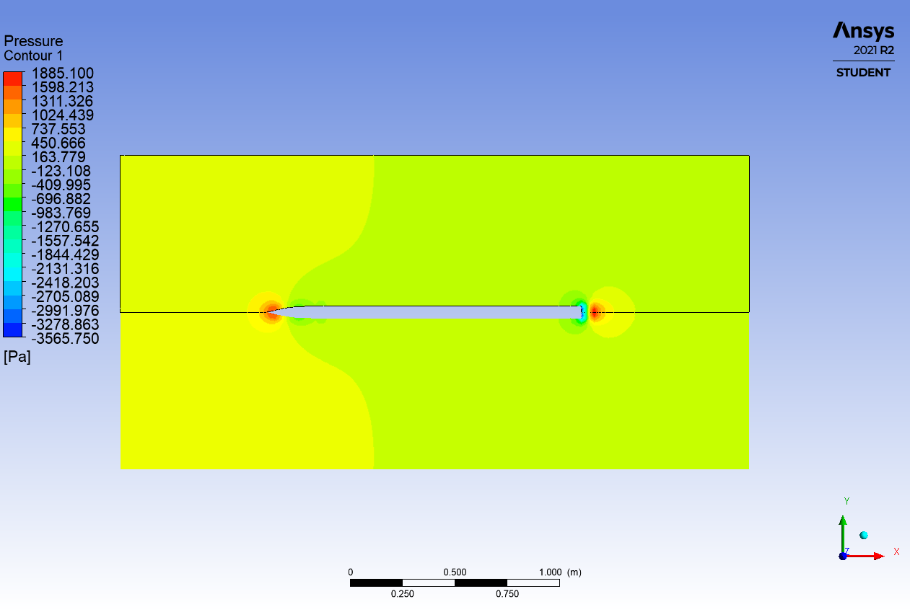
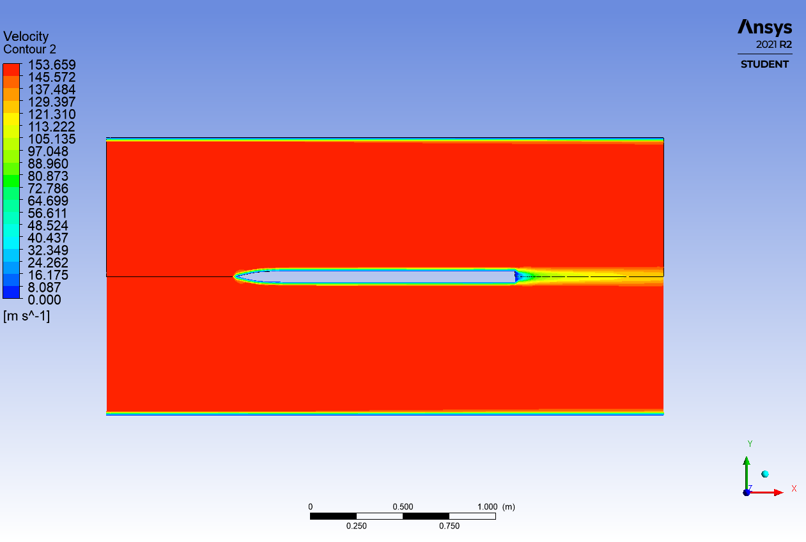
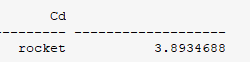
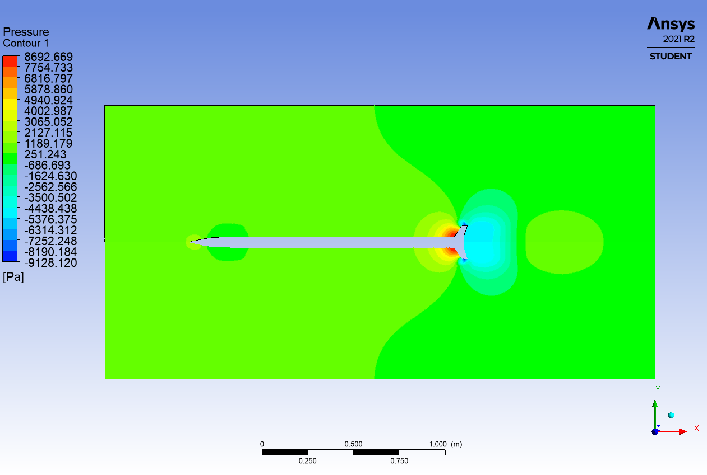
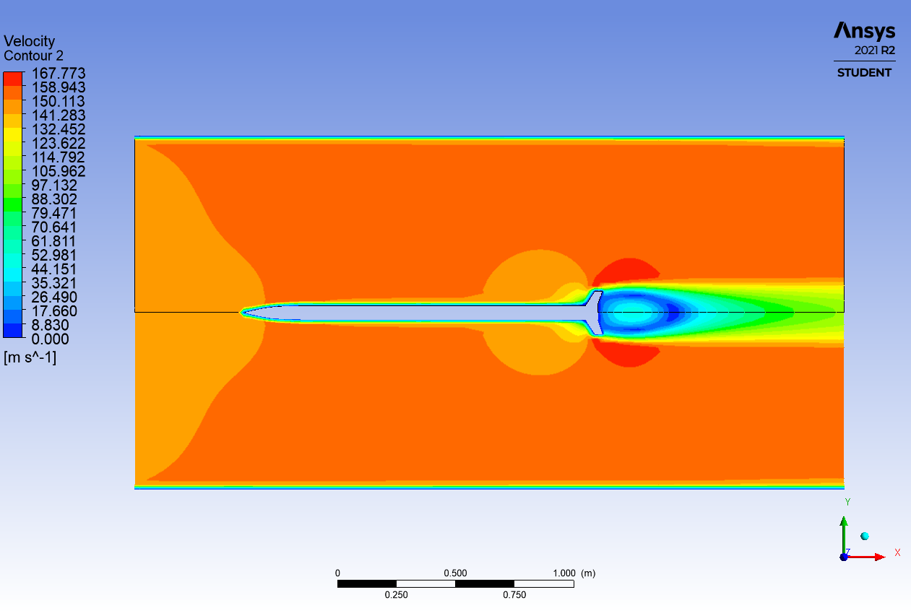

# N2 airframe 

## CFD result
計算条件

- 風速 150m （N-2ロケットの最大値）
-  レイノルズ数 1.5e7

### 抗力係数 Cd

#### 胴体のみ
Cd=0.54

圧力分布

速度分布

#### フィンを配置したとき
（※計算条件として軸対称を指定しているので、厳密に3次元的な配置を再現できているわけではない。実際にはもっと抗力係数は低い）

Cd=3.89

圧力分布

速度分布

